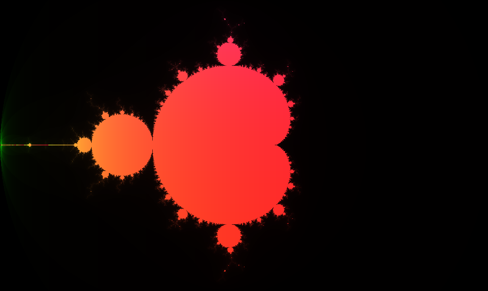
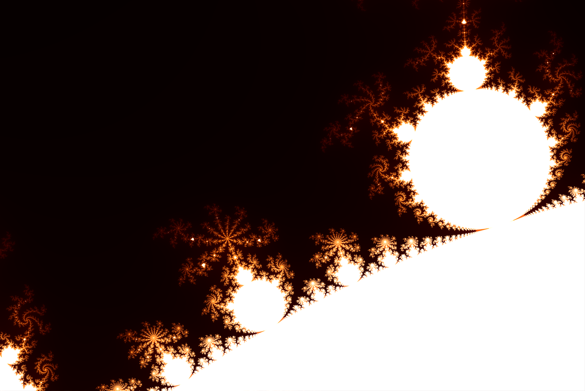
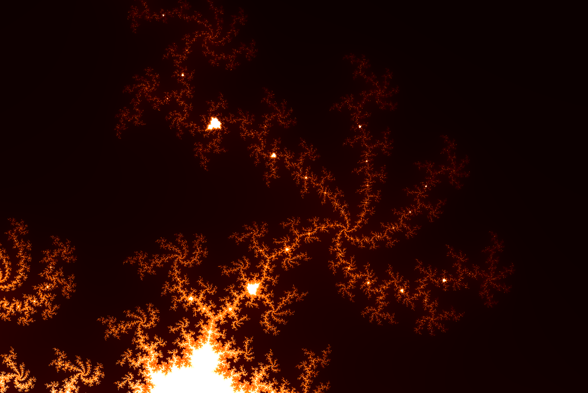

# **Mandelbrot set**
#### Fractal PPM/PGM image generator

A complex number <VAR>c</VAR> is a member of the Mandelbrot set if <VAR>xi</VAR> remains bounded, for all <VAR>i</VAR>, under the iteration:

<BLOCKQUOTE><VAR>x0 = 0 </VAR> <VAR>xi+1 =
  xi2 + c</VAR> </BLOCKQUOTE>

We sample a square grid in the complex plane in the region [-2,2] + [-2,2]j and consider each pixel part of the set if <VAR>|xi|</VAR> < 2 for all <VAR>i</VAR> < 100

Plotting the number of iterations required to escape the set as pixel intensity (or colour) values, results in these beautiful images.  

By altering the sample region, we can explore detail at an arbitrary zoom:

